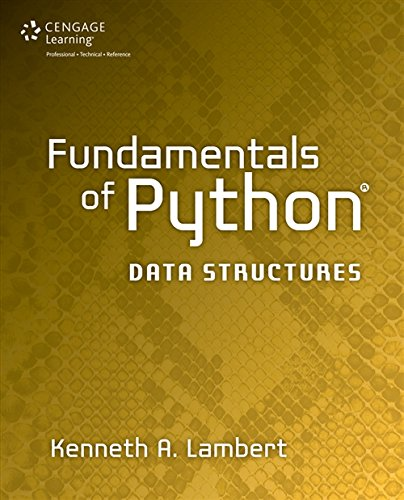
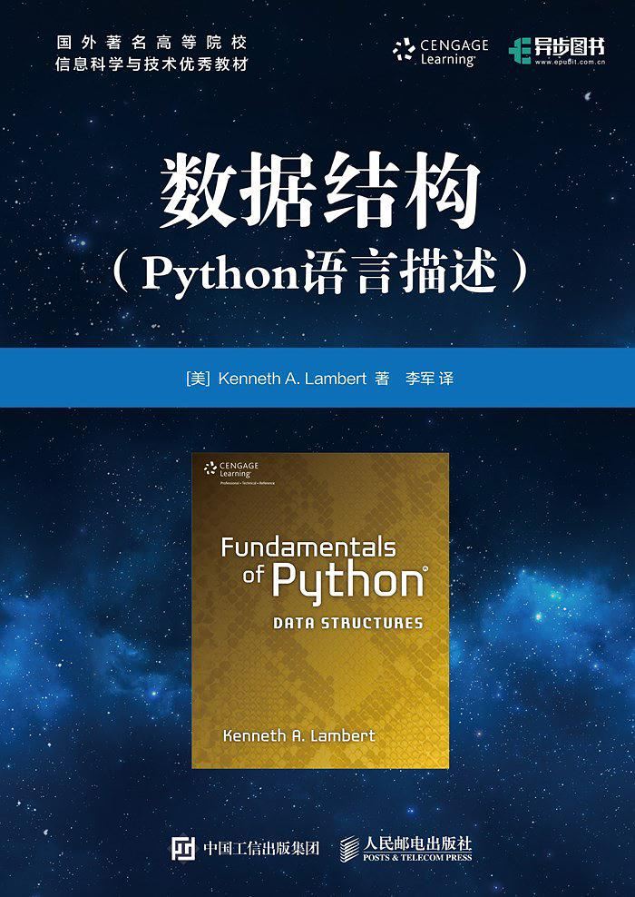

# Fundamentals of Python Data Structures 数据结构：Python语言描述

>"Fundamentals of Python Data Structures" Books and Code
>《数据结构：Python语言描述》书籍和配套代码

## Table of Contents
* CHAPTER 1 Basic Python Programming 
* CHAPTER 2 An Overview of Collections 
* CHAPTER 3 Searching,  Sorting, and Complexity Analysis 
* CHAPTER 4 Arrays and Linked Structures 
* CHAPTER 5  Interfaces, Implementations, and Polymorphism   
* CHAPTER 6 Inheritance and Abstract Classes 
* CHAPTER 7 Stacks 
* CHAPTER 8 Queues
* CHAPTER 9 Lists
* CHAPTER 10 Trees   
* CHAPTER 11 Sets and Dictionaries   
* CHAPTER 12 Graphs

## English version

## Chinese version
